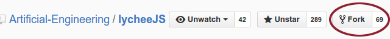
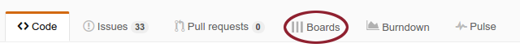

# Contribution Guide for lycheeJS


## Reserved Branches

- the `development` branch is reserved for the master repository.
- the `2XXX-QX` branch scheme is reserved for build bots.


### 1. Create a Fork

Upcoming feature requests are better stored in their own branch, so
we can make usage of pull requests on GitHub.

You have to fork the project on GitHub to your own repository.
This allows you to work on the feature beforehand, even while the
lycheeJS team is undecided whether or not to merge in your features
already.




### 2. Find an Issue

After you have forked the project you can start picking some issues you
want to help us on. Our management tool is [ZenHub](https://www.zenhub.io/)
because it is a Scrum Board that is directly integrated with the issues
and milestones of GitHub. It allows us to reference the issues in the git
commit messages via their identifier.

For example, you can write `Fixes #1337` or `Further work on issue #1337`
in order to reference your git commits to the relevant Scrum Board Card.

If you have installed ZenHub, you can access the Scrum Board by clicking
on the *Boards* menu that the extension injects to the GitHub website.




### 3. Work on an Issue

This example shows how the feature branches work. Replace `YourName`
accordingly with your GitHub username and `fancy-feature` accordingly with
a better description for your feature that you are working on. The best
name for a feature is the name of the equivalent issue title or its title
shrinked down to the minimum quintessence.


```bash
git clone git@github.com:YourName/lycheeJS.git;
cd lycheeJS;
git checkout development;
git checkout -b fancy-feature;

# BEGIN of your own work
echo "foo" > ./worksimulation.txt;
git add worksimulation.txt;
git commit -m "Meaningful description";
# END of your own work

# After some days of work, make sure you are up-to-date
git pull https://github.com/Artificial-Engineering/lycheeJS.git development;

# The final push to your github repository before your pull request
git push origin fancy-feature;

```


### 4. Contribute a Feature

Now you can go on GitHub to your repository and switch to the
`fancy-feature` branch. After you did that, there's a new green
button appearing with the label `Compare & pull request`.


Click on it, now you have to fill out the form with the description.
After that, we can now automatically merge in your implemented features.


### Notes on API Documentation


If you want to contribute to the API documentation, please use the guide
in the above described workflow and replace `fancy-feature` with
`documentation-definition` where `definition` is the definition you are
working on.

As a documentation format, we use [CommonMark](http://commonmark.org), with
GitHub flavored syntax. We also have some features in to have full
compatibility with our HTML DOM, so there are slightly more features in our
format.

The [API Tool](../projects/cultivator/api) helps you to generate API
documentation automatically. If there's no API documentation existing for a
Definition, it will show you a textarea with the initial content similar to
this, including all required structural parts and as far auto-generated as
possible:


The folder structure is setup like this:

```javascript
if (exists('/lib/lychee/source/ui/Entity.js') && !exists('/lib/lychee/api/ui/Entity.md')) {
    contributor.writeAPIDocs('lychee.ui.Entity', '/lib/lychee/api/ui/Entity.md');
}
```

