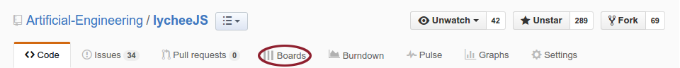
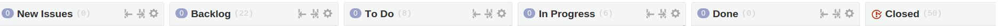
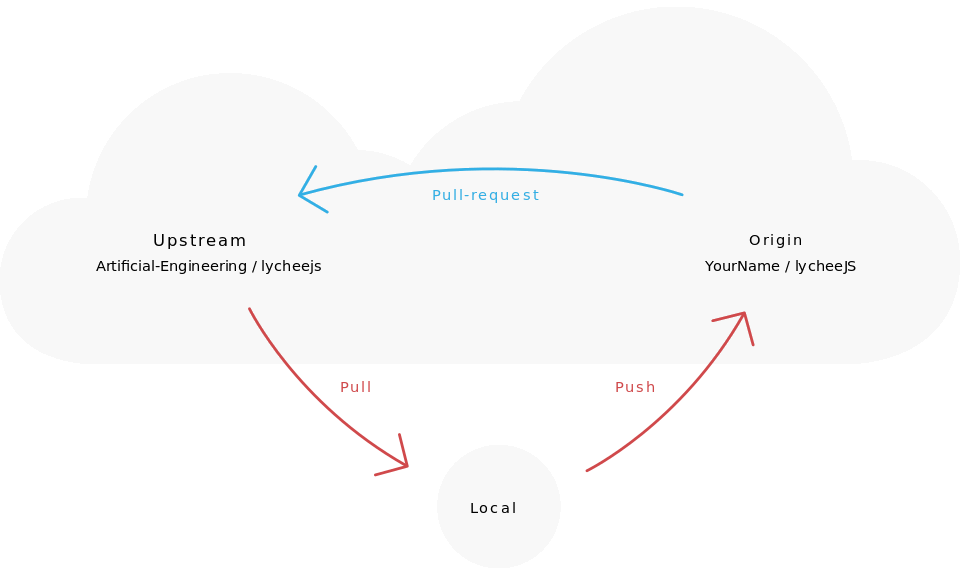

# Contribution Guide for lycheeJS

- [Fork Management](#fork-management)

1. [Find an Issue](#find-an-issue)
2. [Assign an Issue](#assign-an-issue)
3. [Work on an Issue](#work-on-an-issue)
4. [Contribute a Feature](#contribute-a-feature)
5. [Document a Feature](#document-a-feature)
6. [Git Commit Messaeges](#git-commit-messages)


## Fork Management

The main repository is hooked up with build bots. In order to not
conflict with any script, these branches are reserved and therefore
not accepted as branches of pull requests.

- the `development` branch is reserved for the master repository.
- the `2XXX-QX` branch scheme is reserved for the master repository.


Upcoming feature requests are better stored in their own branch, so
we can make usage of pull requests on GitHub.

You have to fork the project on GitHub to your own repository.
This allows you to work on the feature beforehand, even while the
lycheeJS team is undecided whether or not to merge in your features
already.


## Find an Issue

After you have forked the project you can start picking some issues you
want to help us on. Our management tool is [ZenHub](https://www.zenhub.io/)
because it is a Scrum Board that is directly integrated with the issues
and milestones of GitHub. It allows us to reference the issues in the git
commit messages via their identifier.

For example, you can write `Fixes #1337` or `Further work on issue #1337`
in order to reference your git commits to the relevant Scrum Board Card.

If you have installed ZenHub, you can access the Scrum Board by clicking
on the *Boards* menu that the extension injects to the GitHub website.




## Assign an Issue

When you've found something you like to work on, you can assign an issue
to yourself so that the other lycheeJS team members know what you're
working on. This helps them to help you, they love to help you :)


## Work on an Issue

Before you start to work, please make your IDE or Editor functional with
the `.editorconfig` file. We use this in order to prevent unnecessary
merge conflicts. For further information on how to setup your IDE with
it, please read the instructions at [http://editorconfig.org/#download](http://editorconfig.org/#download).

If you are working on an Issue make sure you keep track of the Task on the
`Boards` Menu Entry (added by the ZenHub Extension). Select an Issue from
`Backlog` and switch the progress state of your Issue by dragging and
dropping it onto the `In Progress` column.



This example shows how the feature branches work. Replace `YourName`
accordingly with your GitHub username and `fancy-feature` accordingly with
a better description for your feature that you are working on. The best
name for a feature is the name of the equivalent issue title or its title
shrinked down to the minimum quintessence.

```bash
git clone git@github.com:YourName/lycheeJS.git;
cd lycheeJS;
git checkout development;
git checkout -b fancy-feature;

# BEGIN of your own work
echo "foo" > ./worksimulation.txt;
git add worksimulation.txt;
git commit -m "Meaningful description";
# END of your own work

# After some days of work, make sure you are up-to-date
git pull https://github.com/Artificial-Engineering/lycheeJS.git development;

# The final push to your github repository before your pull request
git push origin fancy-feature;
```

We use a triangular git workflow to ensure your work is being merged in
correctly and does not break existing tests and build toolchains.

This workflow basically means that you work only actively on your own
fork and not the upstream project itself. You always pull from the upstream
project, work on your tasks locally and push to your own fork on github.

After work being done you can use the Pull Request directly without any
merge conflicts. In the following example we use `upstream` as the upstream
reference and `origin` as the reference to your fork, as it is the
git-defaulted one.



```bash
git remote add upstream git@github.com:Artificial-Engineering/lycheeJS.git;
git pull upstream development;
```

Your changes and commits have to been pushed to the origin (your own fork).
Since this is already defined as origin you can just push to it directly.

```bash
git push origin
```

If you want us to get your changes in the `upstream` remote, you have to
create a `pull request` from your own fork.
Try to avoid pulling from your own fork so you aren't getting out-of-date.
And never try to push directly to the `upstream` remote as you don't want
to break the `pull request` workflow!


## Contribute a Feature

Now you can go on GitHub to your repository and switch to the
`fancy-feature` branch. After you did that, there's a new green
button appearing with the label `Compare & pull request`.


Click on it, now you have to fill out the form with the description.
When you've finished your Issue and have created your pull request you have to drag the Issue on the "Board" to Done.

After that, we can now automatically merge in your implemented features and close the Issue.


## Document a Feature

If you want to contribute a feature or a definition, please document - so
that others can understand it more easily.

As a documentation format, we use [CommonMark](http://commonmark.org), with
GitHub flavored syntax. We also have some features in to have full
compatibility with our HTML DOM, so there are slightly more features in our
format.

The [API Tool](../projects/cultivator/api) helps you to generate API
documentation automatically. If there's no API documentation existing for a
Definition, it will show you a textarea with the initial content similar to
this, including all required structural parts and as far auto-generated as
possible:


You can either choose to edit the documentation file inside the API Tool
or the text editor of your choice (`VIM` is recommended, of course).
If you are done, you can save the file to the `/api` folder of the relevant
library or project while following this folder structure:

```javascript
if (exists('/lib/lychee/source/ui/Entity.js') && !exists('/lib/lychee/api/ui/Entity.md')) {
    contributor.getAPIDocs('lychee.ui.Entity');
	contributor.saveToFile('/lib/lychee/api/ui/Entity.md');
}
```

## Git Commit Messages

* Present tense ("Fix CSS" not "Fixed CSS")
* Imperative mood ("Read the book" not "Reads the book")
* Always reference the issues and pull requests
* Start the commit Message with an emoji:
	* :bug: `:bug:` when fixing a bug
	* :bomb: `:bomb:` when fixing something on Windows
	* :apple: `:apple:` Mac OS stuff
	* :penguin: `:penguin:` Linux stuff
	* :book: `:book:` writing docs
	* :rocket: `:rocket:` performance improvements
	* :art: `:art:` Design improvements
	* :recycle: `:recycle:` Refactoring
	* :shit: `:shit:` when something went wrong with previous commit
	* :snowflake: `:snowflake:` for unstable prototypes 
	* :sparkles: `:sparkles:` magical improvements of the format/structure of the code
	* :gun: `:gun:` tests
	* :facepunch: `:facepunch:` refactoring crapy shit because of stupid APIs
	* :lipstick: `:lipstick:` fixing CSS stuff
	* :x: `:x:` when removing code or files
	* :hammer: `:hammer:` security stuff

